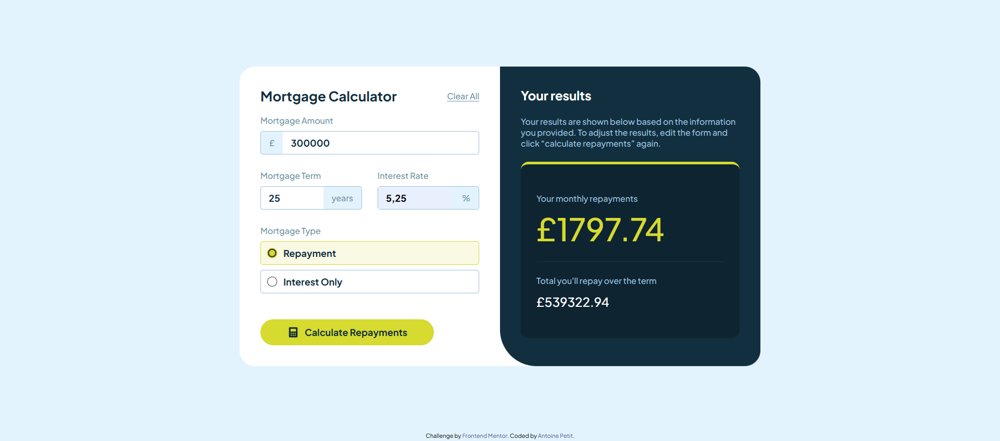

# Frontend Mentor - Mortgage repayment calculator solution

This is a solution to the [Mortgage repayment calculator challenge on Frontend Mentor](https://www.frontendmentor.io/challenges/mortgage-repayment-calculator-Galx1LXK73). Frontend Mentor challenges help you improve your coding skills by building realistic projects. 

## Table of contents

- [Overview](#overview)
  - [The challenge](#the-challenge)
  - [Screenshot](#screenshot)
  - [Links](#links)
- [My process](#my-process)
  - [Built with](#built-with)
  - [What I learned](#what-i-learned)
  - [Continued development](#continued-development)
- [Author](#author)

**Note: Delete this note and update the table of contents based on what sections you keep.**

## Overview

### The challenge

Users should be able to:

- Input mortgage information and see monthly repayment and total repayment amounts after submitting the form
- See form validation messages if any field is incomplete
- Complete the form only using their keyboard
- View the optimal layout for the interface depending on their device's screen size
- See hover and focus states for all interactive elements on the page

### Screenshot



### Links

- Solution URL: [FrontEndMentor](https://your-solution-url.com)
- Live Site URL: [Github Pages](https://antooinepetit.github.io/Mortgage-repayment-calculator/)

## My process

### Built with

- Semantic HTML5 markup
- CSS custom properties
- Flexbox
- CSS Grid
- JavaScript

### What I learned

I mainly trained to optimize my conditions by using less "if else", like here for exemple:

```js
<p>${choice == 1 ? `Total you'll repay over the term` : `Total interest you'll repay over the term`}</p>
<p id="result-total">£${choice == 1 ? repayment : interest}</p>
```
or here :

```js
errorElement.innerHTML = (amount === '') ? error : valueError;
```
I can feel there is still a lot of improvement on optimizing my code, either on the conditions or functions.

I also keep training to write more readable CSS (to my eyes at least) by writing it like this for exemple:

```css
.active-input{
   span{
      border: 1px solid var(--lime)!important;

      label{
         background: var(--lime)!important;
         border-color: var(--lime)!important;
         color: var(--slate900)!important;
      }
   }
}
```

### Continued development

I want to keep improving on finding shorter ways to code things, so I don't use the same patterns over and over if I can avoid it, so the code is more readable and efficient.
I also want to work on my responsives, because I did it a bit quickly on this project and it's far from perfect.

## Author

- Website - [My Portfolio](https://portfolio-antooinepetit-gmailcoms-projects.vercel.app/)
- Frontend Mentor - [@AntooinePetit](https://www.frontendmentor.io/profile/AntooinePetit)
- Github - [@AntooinePetit](https://github.com/AntooinePetit)

